<div align="center">

# ⚡ LEADSAVER // EXECUTIVE B2B PROSPECTING ENGINE ⚡
### Zero-Subscription LinkedIn to Google Sheets Data Pipeline with Built-in Duplicate Shielding

[](https://chrome.google.com/webstore)
[](https://sheets.google.com)
[](https://github.com/AREKG0/leadsaver)
[](https://opensource.org/licenses/MIT)

<p align="center">
  
</p>

**LeadSaver** is a lightweight, dark-mode glassmorphic Chrome Extension that replaces expensive $80/month CRM scraper tools. With a single click on any LinkedIn profile, it extracts executive credentials and pushes clean JSON directly into your personal Google Sheets CRM via serverless webhooks—complete with real-time **Duplicate Shield Protection**! 🛡️

</div>

---

## 💎 WHY HIGH-VELOCITY SALES TEAMS & FOUNDERS CHOOSE LEADSAVER

| Feature / Metric | 🚫 Traditional Scraper SaaS ($80/mo) | ⚡ LeadSaver (OpenArc Open-Source) |
| :--- | :--- | :--- |
| **Monthly Cost** | $49 to $150+ per seat / user | **$0.00 Forever** (BYO Google Sheet) |
| **Data Ownership** | Stored on sketchy third-party servers | **100% User-Owned** in your personal Drive |
| **Export Friction** | Manual CSV dumps and data formatting | **Instant 48ms Live Webhook Sync** |
| **Duplicate Protection** | Often charges extra for deduplication | **Built-in Smart Shield** blocks duplicate saves |
| **Extension Bloat** | Heavy background memory hog | **Ultralight Vanilla JS / Manifest V3** |

---

## 🚀 LIVE TELEMETRY & SMART DUPLICATE RADAR

<p align="center">
  
</p>

### ✨ Killer Capabilities
- 🏢 **One-Click Data Capture:** Instantly captures Target Name, Executive Headline, Current Company, Location, and URL.
- 🛡️ **Intelligent Duplicate Shield:** Before pushing data, the extension verifies if the target profile has already been captured during your prospecting campaigns, protecting your spreadsheets from clutter.
- 📊 **Executive Telemetry HUD:** Tracks your active prospecting sprint stats, total career captures, and webhook latencies in real time.
- 🌌 **Cyberpunk Dark Glassmorphism UI:** Built with sleek HSL tailored color palettes, Inter typography, and subtle reactive micro-animations.

---

## 🏛️ SERVERLESS ARCHITECTURE PIPELINE

LeadSaver uses a secure, direct-to-cloud webhook architecture that requires absolutely zero third-party databases or API key subscriptions:

```mermaid
graph LR
    A[LinkedIn Profile Page] -->|DOM Scraper| B[LeadSaver Content Script]
    B -->|Local Verification| C[Duplicate Shield Radar]
    C -->|Verified JSON Payload| D[Chrome Service Worker]
    D -->|HTTPS Webhook| E[Google Apps Script Engine]
    E -->|Instant Append| F[(Personal Google Sheet CRM)]
    
    style A fill:#0c1422,stroke:#00A0DC,stroke-width:2px,color:#fff
    style C fill:#1e1b4b,stroke:#A78BFA,stroke-width:2px,color:#fff
    style E fill:#065f46,stroke:#10B981,stroke-width:2px,color:#fff
    style F fill:#0a0e17,stroke:#F2C94C,stroke-width:2px,color:#fff
```



---

## ⚡ QUICK SETUP (UNDER 5 MINUTES)

### Step 1: Set Up Google Sheets (Your Free Serverless Backend)
1. Open [Google Sheets](https://sheets.google.com) and create a **new blank spreadsheet**.
2. In **Row 1**, type these exact headers across columns A through F:

| A | B | C | D | E | F |
| :---: | :---: | :---: | :---: | :---: | :---: |
| **Name** | **Headline** | **Company** | **Location** | **Profile URL** | **Saved At** |

3. Click **Extensions → Apps Script** from the top menu bar.
4. Delete any default code inside the script editor.
5. Open `google-apps-script/Code.gs` from this project and paste the entire contents into your Apps Script editor.
6. Click **Deploy → New Deployment**.
7. Select deployment type as **Web app**.
8. Set **Execute as** → `Me` and **Who has access** → `Anyone`.
9. Click **Deploy**, authorize permissions, and **copy your unique Web App URL**.

> [!IMPORTANT]
> Keep your Apps Script Web App URL private! Anyone who has this secure webhook URL can insert new lead rows directly into your spreadsheet.

---

### Step 2: Load the Extension into Google Chrome
1. Open Google Chrome and enter `chrome://extensions/` into your address bar.
2. Toggle **Developer Mode** ON (top-right corner switch).
3. Click **Load unpacked** in the top-left menu.
4. Select your root `leadsaver/` repository folder (the folder containing `manifest.json`).
5. The glowing **LeadSaver** bolt icon will appear in your Chrome extensions toolbar! Pin it for quick access! 📌

---

### Step 3: Connect to Your Spreadsheet & Start Prospecting
1. Click the **LeadSaver** icon in your toolbar and click the **⚙️ Settings gear** (top-right of popup).
2. Paste the **Google Apps Script Web App URL** you copied from Step 1.
3. Click **Save Settings**.
4. Navigate to any LinkedIn individual profile (e.g., `linkedin.com/in/executive-target`).
5. Open LeadSaver to view the extracted data preview card and click **"Save to Google Sheets"**. Your new lead appears instantly in your spreadsheet! 🎉

---

## 📁 REPOSITORY STRUCTURE

```bash
leadsaver/
├── 📄 manifest.json              # Chrome Manifest V3 config & host permissions
├── 📄 README.md                  # Executive architecture & setup documentation
├── 🎨 pipeline_animation.svg     # Interactive prospecting data pipeline asset
├── 🎯 lead_radar.svg             # Real-time duplicate protection radar visual
│
├── ⚙️ config/
│   └── config.js                 # Centralized DOM selectors & telemetry settings
├── 🛠️ utils/
│   └── utils.js                  # Shared data validation & formatting utilities
│
├── 🖼️ popup/
│   ├── popup.html                # Glassmorphic executive interface HTML
│   ├── popup.css                 # Dark mode tokenized custom properties & animations
│   └── popup.js                  # Popup interaction logic & webhook triggers
│
├── ⚡ content/
│   └── content.js                # Resilient LinkedIn page extraction engine
├── 🧠 background/
│   └── background.js             # Service Worker (offline storage & duplicate cache)
│
└── 🌐 google-apps-script/
    └── Code.gs                   # Serverless Google Sheets deployment code
```

---

## 🛠️ EXTENSION CUSTOMIZATION & DEVELOPER GUIDE

### 🎨 Modifying the Visual Design System
All CSS tokens (colors, gradients, typography, box shadows) are cleanly modularized inside `popup/popup.css` under the root `:root` selector. Tweak HSL variables to match your personal enterprise branding instantly!

### 🔍 Updating LinkedIn DOM Selectors
If LinkedIn updates its front-end DOM structure during routine site refactors:
1. Right-click the changed profile element on LinkedIn and select **Inspect**.
2. Copy the new CSS class or semantic hierarchy selector.
3. Update the `SEL` config object located at the top of `content/content.js`.

---

<div align="center">

**Built with pride by OpenArc // Anti-Subscription Local-First Software**

*Empowering founders, SDRs, and developers with user-owned workflow automation.*

</div>
